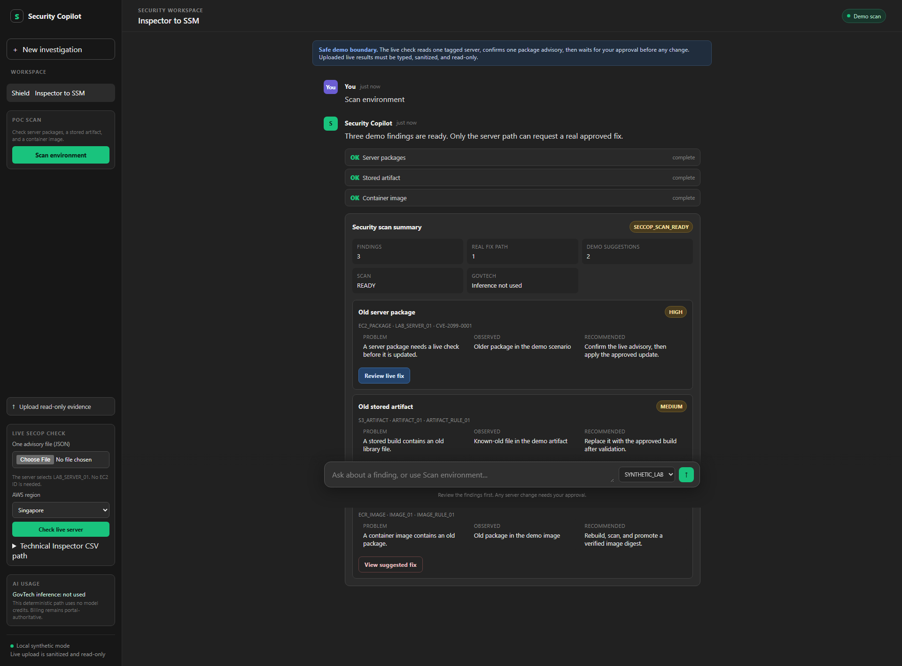
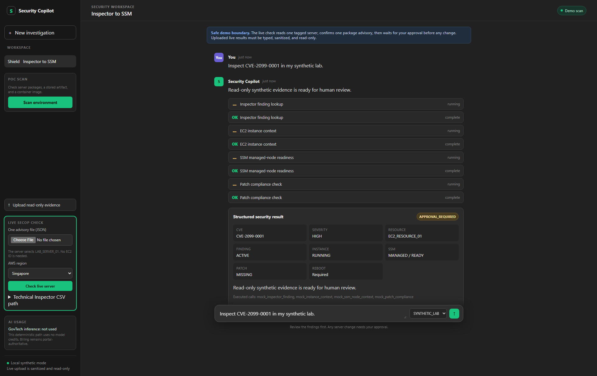
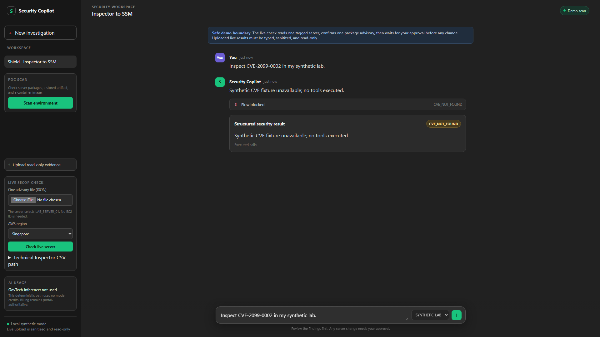

# Find. Approve. Verify.

Security Copilot helps a team turn a security finding into a clear, controlled decision.

<!-- The promise is speed with accountability, not autonomous change. -->

---

## Why this matters now

- Security tools find more issues, faster.
- Fast action can also mean the wrong server or the wrong change.
- Leaders need a simple record of what was found, approved, changed, and checked.

**Goal:** make safe action easy to explain.

---

## One simple operating loop

Find &rarr; Recommend &rarr; Approve &rarr; Act &rarr; Verify

The person stays in control of the sensitive step. The system checks the result afterwards.

---

## What this POC built

<table style="width:100%;border-collapse:collapse;background:#0f1c2f;color:#f4f7fb;font-size:.78em;">
<thead><tr>
<th style="border:1px solid #334155;padding:12px 14px;background:#13243a;color:#67e8f9;text-align:left;">Capability</th>
<th style="border:1px solid #334155;padding:12px 14px;background:#13243a;color:#67e8f9;text-align:left;">Evidence</th>
<th style="border:1px solid #334155;padding:12px 14px;background:#13243a;color:#67e8f9;text-align:left;">What it means</th>
</tr></thead>
<tbody>
<tr><td style="border:1px solid #334155;padding:12px 14px;background:#0f1c2f;color:#f4f7fb;vertical-align:top;">One scan for server, file, and image</td><td style="border:1px solid #334155;padding:12px 14px;background:#0f1c2f;color:#f4f7fb;vertical-align:top;"><code>DEMO-PROVEN</code></td><td style="border:1px solid #334155;padding:12px 14px;background:#0f1c2f;color:#f4f7fb;vertical-align:top;">One conversation starts the review.</td></tr>
<tr><td style="border:1px solid #334155;padding:12px 14px;background:#0f1c2f;color:#f4f7fb;vertical-align:top;">Plain-language recommendation</td><td style="border:1px solid #334155;padding:12px 14px;background:#0f1c2f;color:#f4f7fb;vertical-align:top;"><code>DEMO-PROVEN</code></td><td style="border:1px solid #334155;padding:12px 14px;background:#0f1c2f;color:#f4f7fb;vertical-align:top;">The operator sees the problem and the safe next step.</td></tr>
<tr><td style="border:1px solid #334155;padding:12px 14px;background:#0f1c2f;color:#f4f7fb;vertical-align:top;">Typed, deterministic controls</td><td style="border:1px solid #334155;padding:12px 14px;background:#0f1c2f;color:#f4f7fb;vertical-align:top;"><code>TEST-PROVEN</code></td><td style="border:1px solid #334155;padding:12px 14px;background:#0f1c2f;color:#f4f7fb;vertical-align:top;">Bad or unknown requests stop before tools run.</td></tr>
<tr><td style="border:1px solid #334155;padding:12px 14px;background:#0f1c2f;color:#f4f7fb;vertical-align:top;">Small AWS rehearsal</td><td style="border:1px solid #334155;padding:12px 14px;background:#0f1c2f;color:#f4f7fb;vertical-align:top;"><code>TEST-PROVEN</code></td><td style="border:1px solid #334155;padding:12px 14px;background:#0f1c2f;color:#f4f7fb;vertical-align:top;">S3 and ECR replacement paths were exercised and rescanned.</td></tr>
</tbody></table>

**Status:** `READ-ONLY PROVEN` for the EC2 rehearsal; `TEST-PROVEN` for the
S3/ECR replace-and-rescan path; EC2 package fix `PLANNED`.

---

## The trust boundary

> AI may investigate and recommend.
>
> Trusted controls decide what is allowed.
>
> A person approves a sensitive change.
>
> The system verifies and records the result.

The current POC uses a deterministic Python path. GovTech inference is not required for this proof.

---

## Proof: one scan, three places to look

`DEMO-PROVEN` — the visible flow shows a server package, a stored artifact, and a container image as separate findings.

---

## Proof: approval is visible

`DEMO-PROVEN` — the proposed change is shown before approval. Rejecting it keeps the system read-only.

---

## Proof: unsafe paths stop

`DEMO-PROVEN` — an unknown finding stops with a stable reason code and no tool calls.

---

## Value and one next decision

**Value:** Faster review, a smaller explainable change, and a clear approval record.

**Limitations:** Demo fixtures; GuardDuty, real malware, AgentCore, and new networking are outside this POC.

**Next:** Approve one exact package update on the disposable old-AMI server so the DEMO can show:

**Old package** &rarr; **approved fix** &rarr; **verified clean**

This remains a learning POC, not an enterprise remediation platform.

<!-- Ask for one bounded approval, not approval for autonomous remediation. -->
