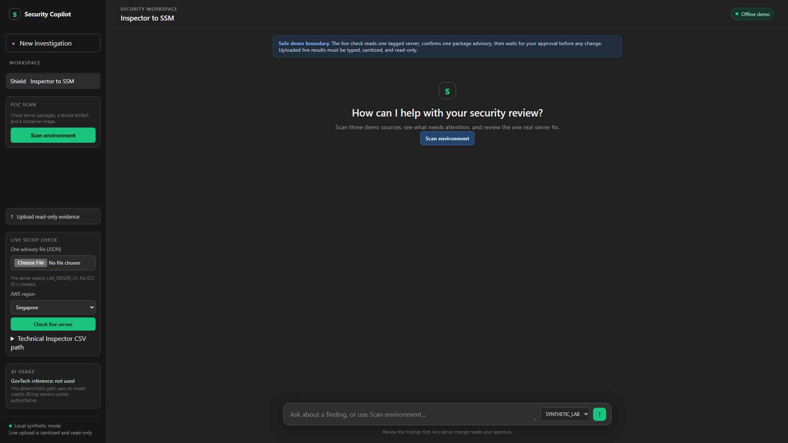
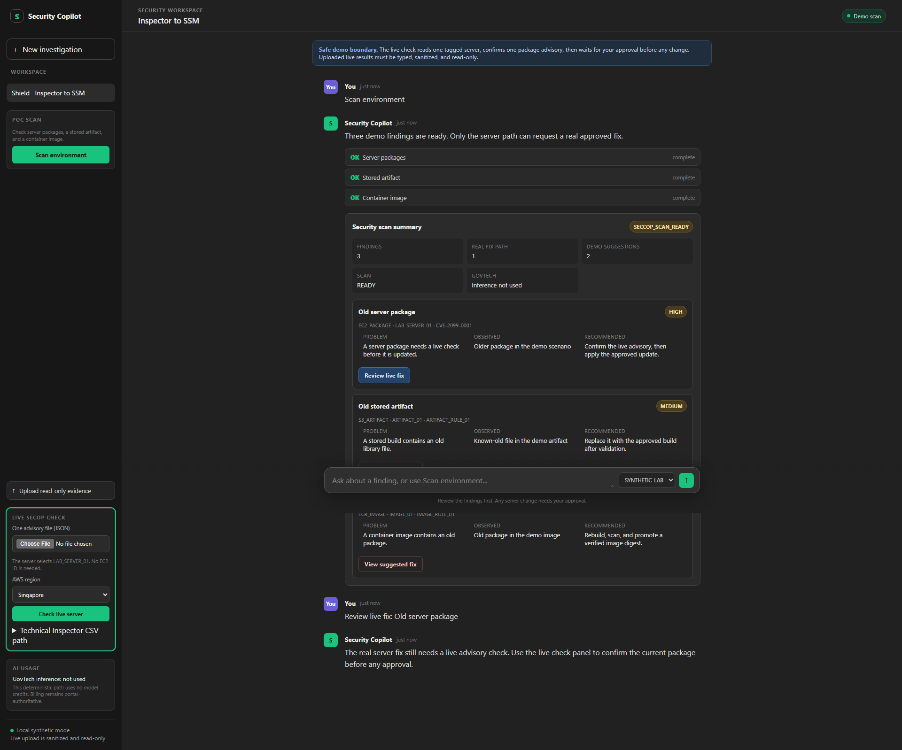
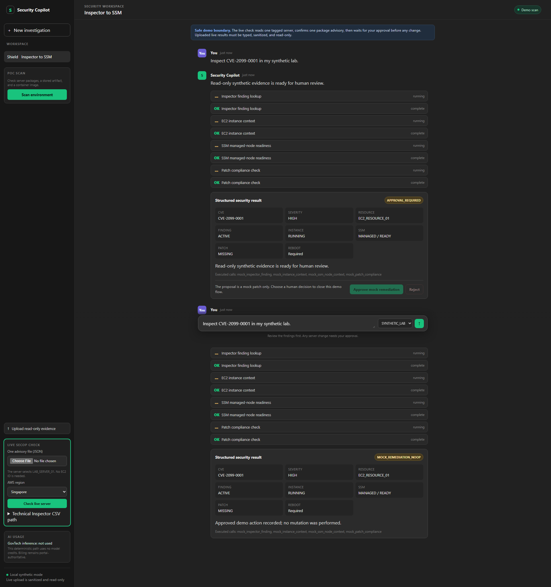
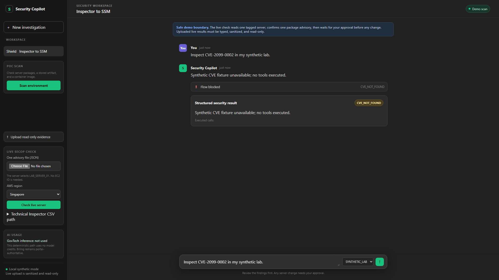

# Security Copilot (SecCop)

## DEMO progress report

This is a short proof of concept, not an enterprise platform.

The current journey is:

**Scan -> understand the finding -> review the safe path -> approve or stop -> see the result**

## What is working

- One **Scan environment** button checks three demo sources.
- The message box starts empty and points the operator to the main scan action.
- The screen shows one server finding, one stored-artifact finding, and one container-image finding.
- The server finding points to the real review and approval path.
- Stored-artifact and container-image findings are clearly marked as read-only suggestions.
- An unknown finding stops immediately and shows a stable reason code.
- The demo approval records **no mutation**.
- The interface shows **GovTech inference: not used** because this path is deterministic.

## Evidence story

### 1. Start the conversation

The operator sees a simple Security Copilot workspace and one clear action: **Scan environment**.



### 2. Scan the three sources

The scan completes with three findings:

- **Old server package** — review the live fix path.
- **Old stored artifact** — suggested fix only.
- **Old container package** — suggested fix only.


### 2A. Review the server path

Selecting **Review live fix** does not change anything. It directs the operator to the live read-only check before an approval can exist.



### 3. Review before approval

The synthetic server result shows the finding, affected demo server, current state, and the approval gate. The operator can approve or reject.


### 4. See the recorded result

After approval, the demo records a successful **no-op** result. It proves the decision flow without changing a server.



### 5. See the safety stop

An unknown CVE is blocked before any tool runs. The screen shows `CVE_NOT_FOUND` and an empty executed-call list.



## What the automated check proved

- The scan returned `READY` with three findings.
- The scan returned no AWS instance IDs or ARNs to the browser.
- The server path stopped for human approval.
- Approval recorded `mutation_performed=false`.
- The unknown-CVE path returned `CVE_NOT_FOUND` with zero executed calls.
- Six screenshots were captured at a fixed 1920 x 1080 browser viewport.
- No external browser requests were made.
- No browser console errors remained.
- The temporary server and browser processes were cleaned up.
- The repeatable command is `./scripts/browser-e2e.sh`; it uses the existing
  Windows Chrome and `playwright-core` over local CDP.

## POC boundary

This POC keeps the useful story small:

- **EC2:** real remediation may be requested only after the existing live checks and explicit approval.
- **S3:** local screenshots show the read-only fixture path; the optional AWS
  backend now supports an approved clean-object replacement.
- **ECR:** local screenshots show the read-only fixture path; the optional AWS
  backend now supports an approved clean-image promotion.
- **GovTech AI:** not used in this deterministic path.
- **AWS mutation:** none was performed for this evidence run.

The AWS backend keeps S3/ECR changes limited to the exact baseline objects and
image tags; broader scanning and new security services remain deferred.

The approved AWS rehearsal is recorded in
[aws-live-rehearsal.md](aws-live-rehearsal.md).

## Run the DEMO locally

```bash
cd <repo-root>
uv run python -m secure_agent_harness.poc_server
```

Open the local server URL shown by the command and press **Scan environment**.

If the default port is already in use by an older local server, start this
version on another free port with `POC_PORT=<free-port> uv run python -m
secure_agent_harness.poc_server`.

The captured screenshots are also copied to the operator-configured review
folder when the browser evidence runner is used.

## Project status

- Issue #21: closed.
- PR #23: merged into `main`.
- KISS guidance: recorded in `README.md` and `AGENTS.md`.
- AgentGuard: still paused.
